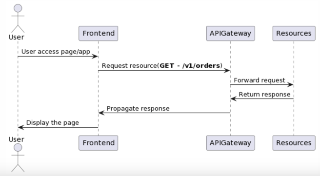
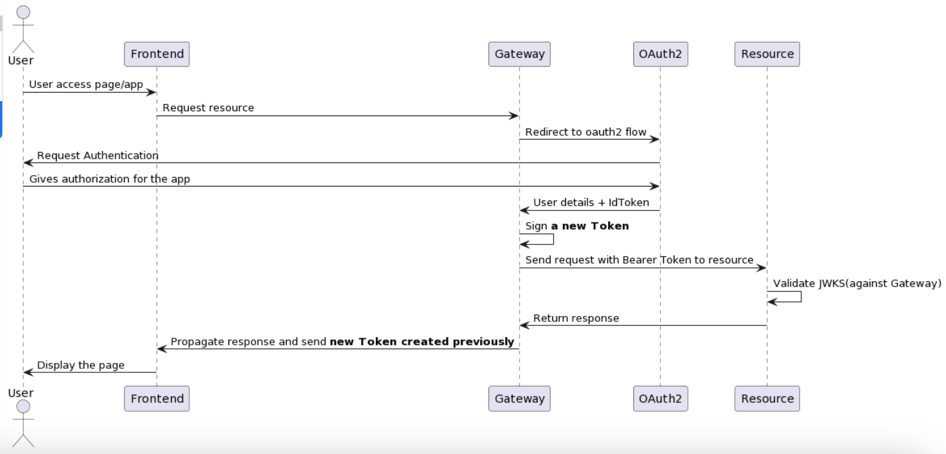
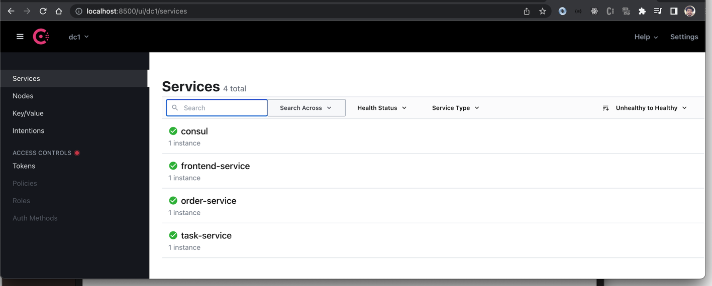
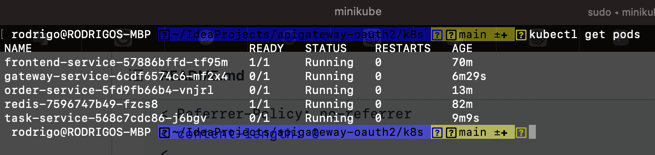

# API Gateway - Oauth2 - Form Login - Downstream Services(frontend/backend)

A showcase demonstrate how to implement Spring Cloud Gateway with Oauth2 for `token + session sharing` propagation across downstream resources(`frontend and backend`).



### Build and run

To build `mvn clean package` then `mvn spring-boot:run` in each folder except `multiple-jwks-validation`.

To use docker `./generate-docker-images.sh` then `docker-compose up` in docker folder.

### Oauth2 Setup

To configure `oauth2` credentials and set the variables in `spring-cloud-gateway/src/main/resources/application.yml` or via environment variable.

```
export GOOGLE_CLIENT_ID=${GOOGLE_CLIENT_ID}
export GOOGLE_CLIENT_SECRET=${GOOGLE_CLIENT_SECRET}
export OKTA_CLIENT_ID=${OKTA_CLIENT_ID}
export OKTA_CLIENT_SECRET=${OKTA_CLIENT_SECRET}
export OKTA_DOMAIN=${OKTA_DOMAIN}
```

Access Gateway by http://localhost:8080 with default users(`user/admin`) and password(`password`).

With `oauth2 login` you can get a valid bearer token access, click in `Authentication Object Tab` and copy tokenValue.

To test by curl with valid token should reply 200.

```
curl -v -H "Authorization: Bearer ..." localhost:8080/v1/orders
*   Trying 127.0.0.1:8080...
* Connected to localhost (127.0.0.1) port 8080 (#0)
> GET /v1/orders HTTP/1.1
> Host: localhost:8080
> User-Agent: curl/7.84.0
> Accept: */*
> Authorization: Bearer ...
[{"orderId":"7114e8d4-c45f-4536-a5cc-9ed73502938f","price":100.00,"user":"default"},{"orderId":"c64d3333-61ed-4005-96a3-dc92d38d3403","price":29.89,"user":"default"}]%
```

Or with invalid/expired token return 401.
```
curl -v -H "Authorization: Invalid Token
*   Trying 127.0.0.1:8080...
* Connected to localhost (127.0.0.1) port 8080 (#0)
> GET /v1/orders HTTP/1.1
> Host: localhost:8080
> User-Agent: curl/7.84.0
> Accept: */*
> Authorization: Invalid Token
> 
* Mark bundle as not supporting multiuse
< HTTP/1.1 401 Unauthorized
< WWW-Authenticate: Bearer
< Cache-Control: no-cache, no-store, max-age=0, must-revalidate
< Pragma: no-cache
< Expires: 0
< X-Content-Type-Options: nosniff
< X-Frame-Options: DENY
< X-XSS-Protection: 1 ; mode=block
< Referrer-Policy: no-referrer
< content-length: 0
< 
```

### Oauth2 flow



### Consul

To access services by consul need to set `SPRING_PROFILES_ACTIVE=consul`



### K8s Setup

Go to `k8s` folder and run the following commands to start minikube.

```
minikube start --memory 4096 --cpus 2
minikube addons enable ingress
```

Pull the docker images `eval $(minikube docker-env)` and `./generate-docker-images.sh` on root folder.

Once images pushed to k8s back to `k8s folder` and deploy the services

```
kubectl apply -f role.yml
kubectl apply -f redis.yml
kubectl apply -f secrets.yml
kubectl create configmap gateway-service --from-file=gateway-configmap.yml
kubectl apply -f gateway.yml
kubectl apply -f ingress.yml
```
PS: Set proper credentials in `secrets.yml`
PS: If services don't deploy(`inage can't be pulled`) double check if docker images are in the correct place(`docker images | grep -service`) 

To access direct by ingress(`localhst`) run `minikube tunnel` in a different terminal.

If that doesn't work can use port-foward command then access by `http://localhost:8080`

```
kubectl port-forward $(kubectl get pod --selector="app=gateway-service" --output jsonpath='{.items[0].metadata.name}') 8080:8080 --address 0.0.0.0
```



More details look at https://www.linkedin.com/pulse/securing-resources-apigatewayspring-cloud-gateway-rodrigo-rodrigues/?published=t

### References
[Spring Cloud Gateway Documentation](https://docs.spring.io/spring-cloud-gateway/docs/current/reference/html/#gateway-starter)

[Secure Spring Cloud Gateway](https://spring.io/blog/2019/08/16/securing-services-with-spring-cloud-gateway)

[Thymeleaf Spring Security Example](https://developer.okta.com/blog/2022/03/24/thymeleaf-security)

[Thymeleaf JQuery Ajax Example](https://riptutorial.com/thymeleaf/example/28530/replacing-fragments-with-ajax)

[Identity Propagation API Gateway](https://medium.com/@robert.broeckelmann/identity-propagation-in-an-api-gateway-architecture-c0f9bbe9273b)

[Minikube] (https://minikube.sigs.k8s.io/docs/handbook/pushing/)

[K8s config map issue](https://stackoverflow.com/questions/56863782/cannot-read-configmap-with-name-xx-in-namespace-default-ignoring)